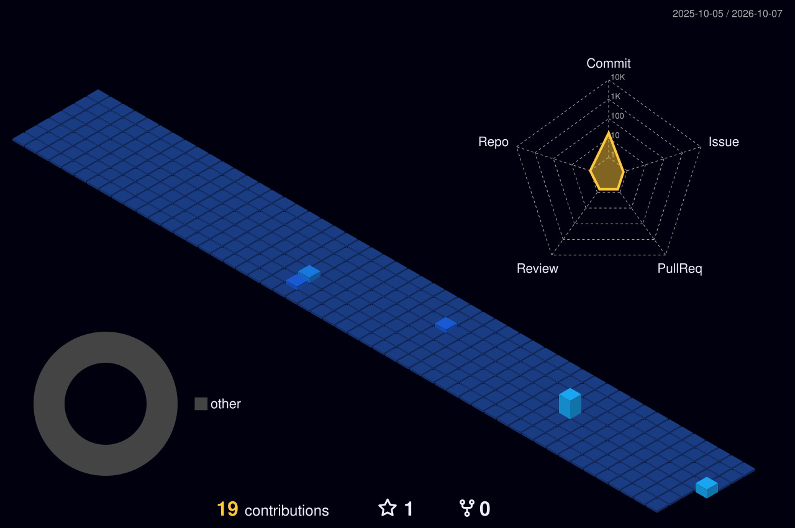

<!-- ========================= HEADER ========================= -->

 

---

## 🧠 Sobre mí

<table>
<tr>
<td width="60%" valign="top">

💼 **+1 año** en el área de Sistemas del **Municipio de Lanús** como programador junior
🌐 Frontend de la página institucional [hcd.lanus.gob.ar](https://hcd.lanus.gob.ar)
🤖 Desarrollo y gestiono flujos conversacionales en **Botmaker** (bots, Agent Developer, lógica de flujos)
👥 Trabajo en equipo con otros programadores
📊 Diseño diagramas de flujo y documentación de procesos
🐍 Python para automatizaciones y proyectos propios
🧬 Prompt engineering avanzado
🎓 Estudiando la **Tecnicatura en Programación** en UTN

</td>
<td width="40%" valign="top">

> 📐 **Mi forma de ver la IA**
>
> Es una herramienta de antesala: la uso para razonar, estructurar y acelerar.
>
> **Pero el criterio es mío.**

</td>
</tr>
</table>

---

## 🚀 Proyectos destacados

### 🧉 Mateplano

**App CAD Web en HTML/CSS/JS puro** — sin frameworks, sin dependencias pesadas.
*Dibujo técnico con estética de cuaderno y precisión de tablero.*

| ✨ Feature | Detalle |
|---|---|
| ♾️ **Canvas infinito** | Scroll táctil y zoom |
| ✏️ **Herramientas** | Líneas, rectángulos, círculos, texto libre |
| 🧲 **Precisión** | Snap a grilla y guías visuales |
| 🖍️ **Estilo rough** | Trazos a mano alzada |
| 🌑 **Diseño** | Oscuro con acento naranja 🟠 |
| 🔒 **Privacidad** | Sin backend, sin login |

<b>👀 Ver todos mis repos destacados</b>

 

---

## 🛠️ Stack & herramientas

**Lenguajes**

**Entorno**

**IA, Prompting & Automatización**

---

## 📊 Estadísticas

 

 

---

## 🧊 Mis commits reales, en 3D

<picture>
  <source media="(prefers-color-scheme: dark)" srcset="./profile-3d-contrib/profile-night-view.svg" />
  <source media="(prefers-color-scheme: light)" srcset="./profile-3d-contrib/profile-green-animate.svg" />
  
</picture>

  

---

## 📬 Contacto

Si querés ver más proyectos o charlar de algo, encontrame por acá o abrí un issue en cualquier repo.
**Siempre estoy iterando algo nuevo** 🛠️

 

> *"Saber pedirle bien a la IA es la mitad del trabajo.*
> *La otra mitad es entender lo que te devuelve."*

